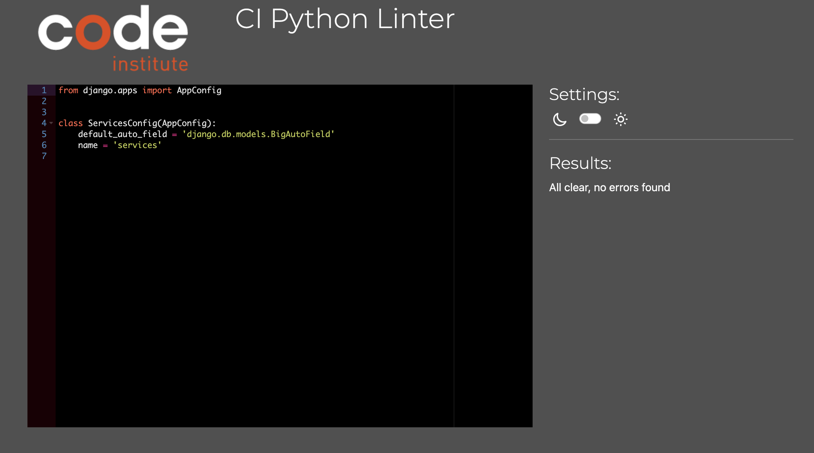
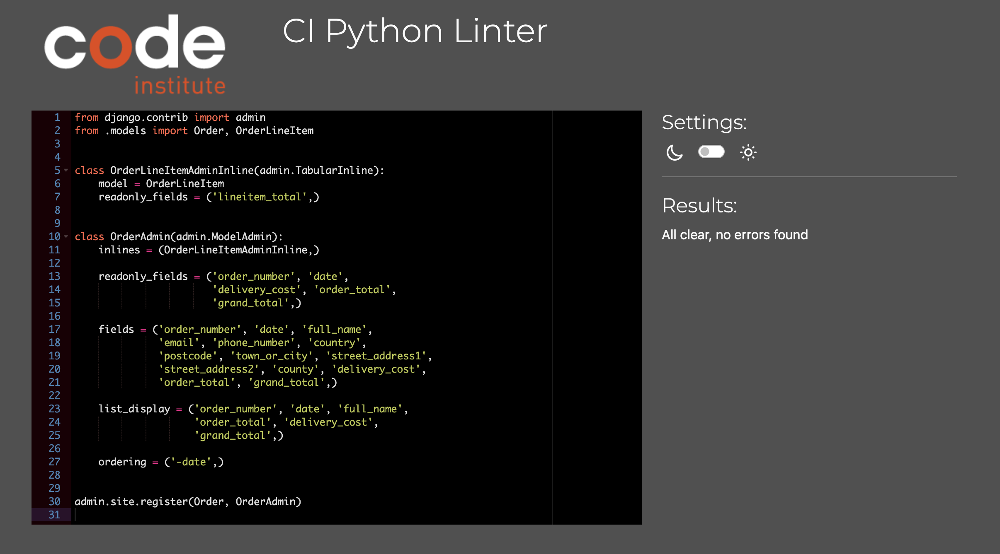
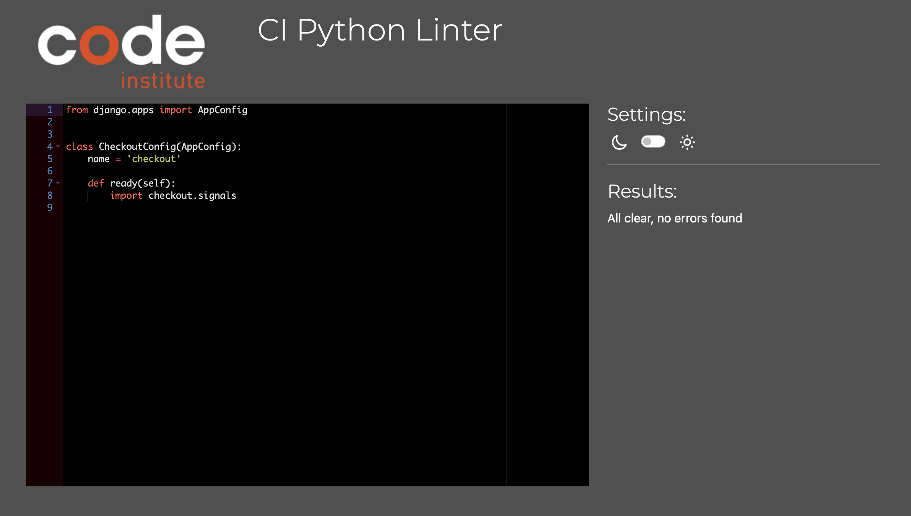
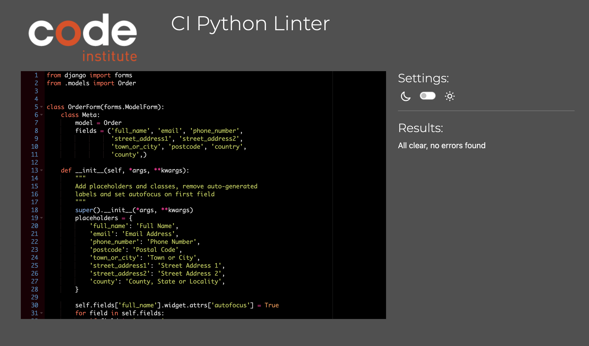

# Testing

Return back to the [README.md](README.md) file.


## Code Validation


### HTML

I have used the recommended [HTML W3C Validator](https://validator.w3.org) to validate all of my HTML files.

| Page | W3C URL | Screenshot | Notes |
| --- | --- | --- | --- |
| Home | [W3C](https://validator.w3.org/nu/?doc=https%3A%2F%2Fpurple-hex-studios.herokuapp.com) |  | Pass: No Errors |
| Contact | [W3C](https://validator.w3.org/nu/?doc=https%3A%2F%2Fpurple-hex-studios.herokuapp.com%2Fcontact%2F) |  | Pass: No Errors |
| Services | [W3C](https://validator.w3.org/nu/?doc=https%3A%2F%2Fpurple-hex-studios.herokuapp.com%2Fservices%2F) |  | Pass: No Errors |
| Service detail  | [W3C](https://validator.w3.org/nu/?doc=https%3A%2F%2Fpurple-hex-studios.herokuapp.com%2Fservices%2Fdetail%2F7%2F) |  | Pass: No Errors |
| Edit Service  | n/a |  | Pass: No Errors |
| Add Service | n/a |  | Pass: No Errors |
| Examples | [W3C](https://validator.w3.org/nu/?doc=https%3A%2F%2Fpurple-hex-studios.herokuapp.com%2Fexamples%2F)|  | Pass: No Errors |
| Checkout | [W3C](https://validator.w3.org/nu/?doc=https%3A%2F%2Fpurple-hex-studios.herokuapp.com%2Fcheckout%2F)|  | Pass: No Errors |
| Bag | [W3C](https://validator.w3.org/nu/?doc=https%3A%2F%2Fpurple-hex-studios.herokuapp.com%2Fbag%2F) |  | Pass: No Errors |
| Profile | n/a |  | Pass: No Errors |
| Login | [W3C](https://validator.w3.org/nu/?doc=https%3A%2F%2Fpurple-hex-studios.herokuapp.com%2Faccounts%2Flogin%2F) |  | Pass: No Errors |
| Sign Up | [W3C](https://validator.w3.org/nu/?doc=https%3A%2F%2Fpurple-hex-studios.herokuapp.com%2Faccounts%2Fsignup%2F) |  | Pass: No Errors |


### CSS

I have used the recommended [CSS Jigsaw Validator](https://jigsaw.w3.org/css-validator) to validate all of my CSS files.

⚠️⚠️⚠️⚠️⚠️ START OF NOTES (to be deleted) ⚠️⚠️⚠️⚠️⚠️

- If you are copying/pasting your HTML code, use this link: https://jigsaw.w3.org/css-validator/#validate_by_input
- (*recommended*) If you are using the live deployed site, use this link: https://jigsaw.w3.org/css-validator/#validate_by_uri

It's recommended to validate the live site if you only have a single CSS file using the deployed URL.
This will give you a custom URL as well, which you can use on your testing documentation.
It makes it easier to return back to the page to validate it again in the future.
The URL will look something like this:

- https://jigsaw.w3.org/css-validator/validator?uri=https%3A%2F%2FThomG1.github.io%2Fpurple-hex-studios

If you have multiple CSS files, then individual [validation by input](https://jigsaw.w3.org/css-validator/#validate_by_input)
is recommended for the additional CSS files.

**IMPORTANT**: Third-Party tools

If you're using extras like Bootstrap, Materialize, Font Awesome, then sometimes the validator
will attempt to also validate this code, even if it's not part of your own actual code.
You are not required to validate the external libraries or frameworks!

Sample CSS code validation documentation (tables are extremely helpful!):

🛑🛑🛑🛑🛑 END OF NOTES (to be deleted) 🛑🛑🛑🛑🛑

| File | Jigsaw URL | Screenshot | Notes |
| --- | --- | --- | --- |
| style.css | [Jigsaw](https://jigsaw.w3.org/css-validator/validator?uri=https%3A%2F%2FThomG1.github.io%2Fpurple-hex-studios) |  | Pass: No Errors |
| checkout.css | n/a |  | Pass: No Errors |
| x | x | x | repeat for all remaining CSS files |

### JavaScript

I have used the recommended [JShint Validator](https://jshint.com) to validate all of my JS files.

⚠️⚠️⚠️⚠️⚠️ START OF NOTES (to be deleted) ⚠️⚠️⚠️⚠️⚠️

If using modern JavaScript (ES6) methods, then make sure to include the following
line at the very top of every single JavaScript file (this should remain in your files for submission):

    /* jshint esversion: 11 */

If you are also including jQuery (`$`), then the updated format will be:

    /* jshint esversion: 11, jquery: true */

This allows the JShint validator to recognize modern ES6 methods, such as:
`let`, `const`, `template literals`, `arrow functions (=>)`, etc.

**IMPORTANT**: External resources

Sometimes we'll write JavaScript that imports variables from other files, such as an array of questions
from `questions.js`, which are used within the main `script.js` file elsewhere.
If that's the case, the JShint validation tool doesn't know how to recognize unused variables
that would normally be imported locally in your code.
These warnings are acceptable to showcase on your screenshots.

The same thing applies when using external libraries such as Stripe, Leaflet, Bootstrap, Materialize, etc..
To instantiate these components, we need to use their respective declarator.
Again, the JShint validation tool would flag these as undefined/unused variables.
These warnings are acceptable to showcase on your screenshots.

Sample JS code validation documentation (tables are extremely helpful!):

🛑🛑🛑🛑🛑 END OF NOTES (to be deleted) 🛑🛑🛑🛑🛑

| File | Screenshot | Notes |
| --- | --- | --- |
| script.js |  | Unused variables from external files |
| questions.js |  | Pass: No Errors |
| quiz.js |  | Unused variables from external files |
| stripe_elements.js |  | Undefined Stripe variable |
| x | x | x | repeat for all remaining JavaScript files |

### Python

⚠️⚠️⚠️⚠️⚠️ START OF NOTES (to be deleted) ⚠️⚠️⚠️⚠️⚠️

The CI Python Linter can be used two different ways.
- Copy/Paste your Python code directly into the linter.
- As an API, using the "raw" URL appended to the linter URL.
    - To find the "raw" URL, navigate to your file directly on the GitHub repo.
    - On that page, GitHub provides a button on the right called "Raw" that you can click on.
    - From that new page, copy the full URL, and paste it after the CI Python Linter URL (with a `/` separator).
    - Check the example table below for a live demo.

It's recommended to validate each file using the API URL.
This will give you a custom URL which you can use on your testing documentation.
It makes it easier to return back to a file to validate it again in the future.
Use the steps above to generate your own custom URLs for each Python file.

**IMPORTANT**: `E501 line too long` errors

You must strive to fix any Python lines that are too long ( >80 characters ).
In rare cases where you cannot break the lines [without breaking the functionality],
then by adding `# noqa` to the end of those lines will ignore linting validation.

`# noqa` = **NO Quality Assurance**

**NOTE**: You must include 2 *spaces* before the `#`, and 1 *space* after the `#`.

Do not use `# noqa` all over your project just to clear down validation errors!
This can still cause a project to fail, for failing to fix actual PEP8 validation errors.

Sometimes strings or variables get too long, or long `if` conditional statements.
These are acceptable instances to use the `# noqa`.

When trying to fix "line too long" errors, try to avoid using `/` to split lines.
A better approach would be to use any type of opening bracket, and hit Enter just after that.

Any opening bracket type will work: `(`, `[`, `{`.

By using an opening bracket, Python knows where to appropriately indent the next line of code,
without having to "guess" yourself and attempt to tab to the correct indentation level.

Sample Python code validation documentation below (tables are extremely helpful!).

**Note**: This gives examples of PP3 (Python-only), and Flask/Django files, so eliminate the ones not applicable to your own project.

🛑🛑🛑🛑🛑 END OF NOTES (to be deleted) 🛑🛑🛑🛑🛑

I have used the recommended [PEP8 CI Python Linter](https://pep8ci.herokuapp.com) to validate all of my Python files.

| File | CI URL | Screenshot | Notes |
| --- | --- | --- | --- |
| settings.py | [PEP8 CI](https://pep8ci.herokuapp.com/https://raw.githubusercontent.com/ThomG1/purple-hex-studios/main/purple_hex/settings.py) |  | E501 line too long |
| Purple Hex urls.py | [PEP8 CI](https://pep8ci.herokuapp.com/https://raw.githubusercontent.com/ThomG1/purple-hex-studios/main/purple_hex/urls.py) |  | Pass: No Errors |
| Services admin.py | [PEP8 CI](https://pep8ci.herokuapp.com/https://raw.githubusercontent.com/ThomG1/purple-hex-studios/main/services/admin.py) |  | Pass: No Errors |
| Services apps.py | [PEP8 CI](https://pep8ci.herokuapp.com/https://raw.githubusercontent.com/ThomG1/purple-hex-studios/main/services/apps.py) |  | Pass: No Errors |
| Services forms.py | [PEP8 CI](https://pep8ci.herokuapp.com/https://raw.githubusercontent.com/ThomG1/purple-hex-studios/main/purple_hex/wsgi.py) |  | Pass: No Errors |
| Services models.py | [PEP8 CI](https://pep8ci.herokuapp.com/https://raw.githubusercontent.com/ThomG1/purple-hex-studios/main/services/models.py) |  | Pass: No Errors |
| Services urls.py | [PEP8 CI](https://pep8ci.herokuapp.com/https://raw.githubusercontent.com/ThomG1/purple-hex-studios/main/services/urls.py) |  | Pass: No Errors |
| Services views.py | [PEP8 CI](https://pep8ci.herokuapp.com/https://raw.githubusercontent.com/ThomG1/purple-hex-studios/main/services/views.py) |  | Pass: No Errors |
| Bag apps.py | [PEP8 CI](https://pep8ci.herokuapp.com/https://raw.githubusercontent.com/ThomG1/purple-hex-studios/main/bag/apps.py) |  | Pass: No Errors |
| Bag contexts.py | [PEP8 CI](https://pep8ci.herokuapp.com/https://raw.githubusercontent.com/ThomG1/purple-hex-studios/main/bag/contexts.py) |  | Pass: No Errors |
| Bag models.py | [PEP8 CI](https://pep8ci.herokuapp.com/https://raw.githubusercontent.com/ThomG1/purple-hex-studios/main/bag/models.py) |  | Pass: No Errors |
| Bag urls.py | [PEP8 CI](https://pep8ci.herokuapp.com/https://raw.githubusercontent.com/ThomG1/purple-hex-studios/main/bag/urls.py) |  | Pass: No Errors |
| Bag views.py | [PEP8 CI](https://pep8ci.herokuapp.com/https://raw.githubusercontent.com/ThomG1/purple-hex-studios/main/bag/views.py) |  | Pass: No Errors |
| Checkout admin.py | [PEP8 CI](https://pep8ci.herokuapp.com/https://raw.githubusercontent.com/ThomG1/purple-hex-studios/main/checkout/admin.py) |  | Pass: No Errors |
| Checkout apps.py | [PEP8 CI](https://pep8ci.herokuapp.com/https://raw.githubusercontent.com/ThomG1/purple-hex-studios/main/checkout/apps.py) |  | Pass: No Errors |
| Checkout forms.py | [PEP8 CI](https://pep8ci.herokuapp.com/https://raw.githubusercontent.com/ThomG1/purple-hex-studios/main/checkout/forms.py) |  | Pass: No Errors |
| Checkout models.py | [PEP8 CI](https://pep8ci.herokuapp.com/https://raw.githubusercontent.com/ThomG1/purple-hex-studios/main/checkout/models.py) |  | Pass: No Errors |
| Checkout signals.py | [PEP8 CI](https://pep8ci.herokuapp.com/https://raw.githubusercontent.com/ThomG1/purple-hex-studios/main/checkout/signals.py) |  | Pass: No Errors |
| Checkout urls.py | [PEP8 CI](https://pep8ci.herokuapp.com/https://raw.githubusercontent.com/ThomG1/purple-hex-studios/main/checkout/urls.py) |  | Pass: No Errors |
| Checkout views.py | [PEP8 CI](https://pep8ci.herokuapp.com/https://raw.githubusercontent.com/ThomG1/purple-hex-studios/main/checkout/views.py) |  | Pass: No Errors |
| Profiles admin.py | [PEP8 CI](https://pep8ci.herokuapp.com/https://raw.githubusercontent.com/ThomG1/purple-hex-studios/main/profiles/admin.py) |  | Pass: No Errors |
| Profiles apps.py | [PEP8 CI](https://pep8ci.herokuapp.com/https://raw.githubusercontent.com/ThomG1/purple-hex-studios/main/profiles/apps.py) |  | Pass: No Errors |
| Profiles forms.py | [PEP8 CI](https://pep8ci.herokuapp.com/https://raw.githubusercontent.com/ThomG1/purple-hex-studios/main/profiles/forms.py) |  | Pass: No Errors |
| Profiles models.py | [PEP8 CI](https://pep8ci.herokuapp.com/https://raw.githubusercontent.com/ThomG1/purple-hex-studios/main/profiles/models.py) |  | Pass: No Errors |
| Profiles urls.py | [PEP8 CI](https://pep8ci.herokuapp.com/https://raw.githubusercontent.com/ThomG1/purple-hex-studios/main/profiles/urls.py) |  | Pass: No Errors |
| Profiles views.py | [PEP8 CI](https://pep8ci.herokuapp.com/https://raw.githubusercontent.com/ThomG1/purple-hex-studios/main/profiles/views.py) |  | Pass: No Errors |
| Home admin.py | [PEP8 CI](https://pep8ci.herokuapp.com/https://raw.githubusercontent.com/ThomG1/purple-hex-studios/main/home/admin.py) |  | Pass: No Errors |
| Home apps.py | [PEP8 CI](https://pep8ci.herokuapp.com/https://raw.githubusercontent.com/ThomG1/purple-hex-studios/main/home/apps.py) |  | Pass: No Errors |
| Home forms.py | [PEP8 CI](https://pep8ci.herokuapp.com/https://raw.githubusercontent.com/ThomG1/purple-hex-studios/main/home/forms.py) |  | Pass: No Errors |
| Home models.py | [PEP8 CI](https://pep8ci.herokuapp.com/https://raw.githubusercontent.com/ThomG1/purple-hex-studios/main/home/models.py) |  | Pass: No Errors |
| Home urls.py | [PEP8 CI](https://pep8ci.herokuapp.com/https://raw.githubusercontent.com/ThomG1/purple-hex-studios/main/home/urls.py) |  | Pass: No Errors |
| Home views.py | [PEP8 CI](https://pep8ci.herokuapp.com/https://raw.githubusercontent.com/ThomG1/purple-hex-studios/main/home/views.py) |  | Pass: No Errors |
| Contact admin.py | [PEP8 CI](https://pep8ci.herokuapp.com/https://raw.githubusercontent.com/ThomG1/purple-hex-studios/main/contact/admin.py) |  | Pass: No Errors |
| Contact apps.py | [PEP8 CI](https://pep8ci.herokuapp.com/https://raw.githubusercontent.com/ThomG1/purple-hex-studios/main/contact/apps.py) |  | Pass: No Errors |
| Contact forms.py | [PEP8 CI](https://pep8ci.herokuapp.com/https://raw.githubusercontent.com/ThomG1/purple-hex-studios/main/contact/forms.py) |  | Pass: No Errors |
| Contact models.py | [PEP8 CI](https://pep8ci.herokuapp.com/https://raw.githubusercontent.com/ThomG1/purple-hex-studios/main/contact/models.py) |  | Pass: No Errors |
| Contact urls.py | [PEP8 CI](https://pep8ci.herokuapp.com/https://raw.githubusercontent.com/ThomG1/purple-hex-studios/main/contact/urls.py) |  | Pass: No Errors |
| Contact views.py | [PEP8 CI](https://pep8ci.herokuapp.com/https://raw.githubusercontent.com/ThomG1/purple-hex-studios/main/contact/views.py) |  | Pass: No Errors |
| Examples admin.py | [PEP8 CI](https://pep8ci.herokuapp.com/https://raw.githubusercontent.com/ThomG1/purple-hex-studios/main/examples/admin.py) |  | Pass: No Errors |
| Examples apps.py | [PEP8 CI](https://pep8ci.herokuapp.com/https://raw.githubusercontent.com/ThomG1/purple-hex-studios/main/examples/apps.py) |  | Pass: No Errors |
| Examples forms.py | [PEP8 CI](https://pep8ci.herokuapp.com/https://raw.githubusercontent.com/ThomG1/purple-hex-studios/main/examples/forms.py) |  | Pass: No Errors |
| Examples models.py | [PEP8 CI](https://pep8ci.herokuapp.com/https://raw.githubusercontent.com/ThomG1/purple-hex-studios/main/examples/models.py) |  | Pass: No Errors |
| Examples urls.py | [PEP8 CI](https://pep8ci.herokuapp.com/https://raw.githubusercontent.com/ThomG1/purple-hex-studios/main/examples/urls.py) |  | Pass: No Errors |
| Examples views.py | [PEP8 CI](https://pep8ci.herokuapp.com/https://raw.githubusercontent.com/ThomG1/purple-hex-studios/main/examples/views.py) |  | Pass: No Errors |


| x | x | x | repeat for all remaining Python files |

**IMPORTANT**: Django settings.py

The Django settings.py file comes with 4 lines that are quite long, and will throw the `E501 line too long` error.
This is default behavior, but can be fixed by adding `# noqa` to the end of those lines.

Example:

```python
AUTH_PASSWORD_VALIDATORS = [
    {
        "NAME": "django.contrib.auth.password_validation.UserAttributeSimilarityValidator",  # noqa
    },
    {
        "NAME": "django.contrib.auth.password_validation.MinimumLengthValidator",  # noqa
    },
    {
        "NAME": "django.contrib.auth.password_validation.CommonPasswordValidator",  # noqa
    },
    {
        "NAME": "django.contrib.auth.password_validation.NumericPasswordValidator",  # noqa
    },
]
```

**IMPORTANT**: migration and pycache files

You do not have to ever validate files from the `migrations/` or `pycache/` folders!
Ignore these `.py` files, and validate just the files that you've created or modified.

🛑🛑🛑🛑🛑 END OF NOTES (to be deleted) 🛑🛑🛑🛑🛑

## Browser Compatibility

I've tested my deployed project on multiple browsers to check for compatibility issues.

| Browser | Screenshot | Notes |
| --- | --- | --- |
| Chrome |  | Works as expected |
| Firefox |  | Works as expected |
| Safari |  | Works as expected |


## Responsiveness

I've tested my deployed project on multiple devices to check for responsiveness issues.

| Device | Screenshot | Notes |
| --- | --- | --- |
| Mobile (DevTools) |  | Works as expected |
| Tablet (DevTools) |  | Works as expected |
| Desktop |  | Works as expected |


## Lighthouse Audit

I've tested my deployed project using the Lighthouse Audit tool to check for any major issues.

| Page | Size | Screenshot | Notes |
| --- | --- | --- | --- |
| Home | Mobile |  | Some minor warnings |
| Home | Desktop |  | Few warnings |
| About | Mobile |  | Some minor warnings |
| About | Desktop |  | Few warnings |
| Gallery | Mobile |  | Slow response time due to large images |
| Gallery | Desktop |  | Slow response time due to large images |
| x | x | x | repeat for any other tested pages/sizes |

## Defensive Programming

Defensive programming was manually tested with the below user acceptance testing:

| Page | User Action | Expected Result | Pass/Fail | Comments |
| --- | --- | --- | --- | --- |
| Home Page | | | | |
| | Click on Logo | Redirection to Home page | Pass | |
| | Click on account dropdown in navbar | Displays dropdown | Pass | |
| | Click on account register in navbar | Directs to register page | Pass | |
| | Click on account login in navbar | Directs to login page | Pass | |
| | Click on account management in navbar (if superuser) | Directs to add service page | Pass | |
| | Click on Services dropdown in navbar | Displays services dropdown filtering  | Pass | |
| | Click on all services in navbar | Directs to all services page | Pass | |
| | Click on film & tv in navbar | Filters film and tv services | Pass | |
| | Click on tutorials in navbar | Filters tutorials services | Pass | |
| | Click on mixing & mastering in navbar | Filters mixing & mastering services | Pass | |
| | Click examples on navbar | Directs to examples page | Pass | |
| | Click on Contact link in navbar | Redirection to Contact page | Pass | |
| | Click on bag in navbar | Directs to bag | Pass | |
| | Click on start creating button | Redirects to all services | Pass | |
| Services Page | | | | |
| | Load services | All services load as expected | Pass | |
| | Click on service | Redirect to service detail page | Pass | |
| | Click on edit (if superuser) | Redirect to edit service page | Pass | |
| | Click on delete (if superuser) | Deletes service| Pass | |
| Services Details Page | | | | |
| | Load service details | All details load as expected | Pass | |
| | Select quantity | Allows user to select quantity | Pass | |
| | Click on edit (if superuser) | Redirect to edit service page | Pass | |
| | Click on delete (if superuser) | Deletes service| Pass | |
| | Click add to bag | Adds service to bag | Pass | |
| | Click more | Redirects to all services | Pass | |
| Edit Services Page | | | | |
| | Edit Category | Allow user to edit category | Pass | |
| | Edit Name | Allow user to edit name | Pass | |
| | Edit Description | Allow user to edit description | Pass | |
| | Edit Price | Allow user to edit price | Pass | |
| | Edit image url | Allow user to edit image url | Pass | |
| | Edit image upload | Allow user to upload new image| Pass | |
| | Click update service | Updates service / redirects to service detail page | Pass | |
| | Click cancel | Redirects to all services page | Pass | |
| Examples Page | | | | |
| | Load images | All images load as expected | Pass | |
| | Use carousel next and previous buttons | works as expected | Pass | |
| Contact Page | | | | |
| | Enter first/last name | Field will accept freeform text | Pass | |
| | Enter valid email address | Field will only accept email address format | Pass | |
| | Enter message in textarea | Field will accept freeform text | Pass | |
| | Click the Submit button | Redirects user to form-dump | Pass | User must click 'Back' button to return |
| Sign Up | | | | |
| | Click on Sign Up button | Redirection to Sign Up page | Pass | |
| | Enter valid email address | Field will only accept email address format | Pass | |
| | Enter valid password (twice) | Field will only accept password format | Pass | |
| | Click on Sign Up button | Asks user to confirm email page | Pass | Email sent to user |
| | Confirm email | Redirects user to blank Sign In page | Pass | |
| Log In | | | | |
| | Click on the Login link | Redirection to Login page | Pass | |
| | Enter valid email address | Field will only accept email address format | Pass | |
| | Enter valid password | Field will only accept password format | Pass | |
| | Click Login button | Redirects user to home page | Pass | |
| Log Out | | | | |
| | Click Logout button | Redirects user to logout page | Pass | Confirms logout first |
| | Click Confirm Logout button | Redirects user to home page | Pass | |
| Profile | | | | |
| | Click on Profile button | User will be redirected to the Profile page | Pass | |
| | Click on the Edit button | User will be redirected to the edit profile page | Pass | |
| | Brute forcing the URL to get to another user's profile | User should be given an error | Pass | Redirects user back to own profile |


## User Story Testing

⚠️⚠️⚠️⚠️⚠️ START OF NOTES (to be deleted) ⚠️⚠️⚠️⚠️⚠️

Testing user stories is actually quite simple, once you've already got the stories defined on your README.

Most of your project's **features** should already align with the **user stories**,
so this should as simple as creating a table with the user story, matching with the re-used screenshot
from the respective feature.

🛑🛑🛑🛑🛑 END OF NOTES (to be deleted) 🛑🛑🛑🛑🛑

| User Story | Screenshot |
| --- | --- |
| As a new site user, I would like to easily navigate the site, so that I can explore what is available. |  |
| As a new site user, I would like to browse what services are on offer, so that I can consider a purchase. |  |
| As a new site user, I would like to easily make a purchase, so that I can progress towards what I want. |  |
| As a new site user, I would like to enjoy the original aesthetic of the application, so that I can return and shop again. |  |
| As a returning site user, I would like to save my details, so that I can make quicker purchases in future. |  |
| As a returning site user, I would like to contact the site, so that I can answer any queries. |  |
| As a returning site user, I would like to explore another cateogory of service, so that I can expand what I'm creating. |  |
| As a returning site user, I would like to explore the sites previous work, so that I can inform my future decisions.|  |
| As a site administrator, I should be able to add new services to my site, so that I can interest new customers. |  |
| As a site administrator, I should be able to ammend existing services, so that I can meet the needs of the studio. |  |
| As a site administrator, I should be able to delete exisiting services, so that I can meet the needs of the studio. |  |
| As a site administrator, I should be able to keep track of my orders, so that I can analyse the data. |  |


## Automated Testing

I have conducted a series of automated tests on my application.

I fully acknowledge and understand that, in a real-world scenario, an extensive set of additional tests would be more comprehensive.

### JavaScript (Jest Testing)

⚠️⚠️⚠️⚠️⚠️ START OF NOTES (to be deleted) ⚠️⚠️⚠️⚠️⚠️

Adjust the code below (file names, etc.) to match your own project files/folders.

🛑🛑🛑🛑🛑 END OF NOTES (to be deleted) 🛑🛑🛑🛑🛑

I have used the [Jest](https://jestjs.io) JavaScript testing framework to test the application functionality.

In order to work with Jest, I first had to initialize NPM.

- `npm init`
- Hit `enter` for all options, except for **test command:**, just type `jest`.

Add Jest to a list called **Dev Dependencies** in a dev environment:

- `npm install --save-dev jest`

**IMPORTANT**: Initial configurations

When creating test files, the name of the file needs to be `file-name.test.js` in order for Jest to properly work.

Due to a change in Jest's default configuration, you'll need to add the following code to the top of the `.test.js` file:

```js
/**
 * @jest-environment jsdom
 */

const { test, expect } = require("@jest/globals");
const { function1, function2, function3, etc. } = require("../script-name");

beforeAll(() => {
    let fs = require("fs");
    let fileContents = fs.readFileSync("index.html", "utf-8");
    document.open();
    document.write(fileContents);
    document.close();
});
```

Remember to adjust the `fs.readFileSync()` to the specific file you'd like you test.
The example above is testing the `index.html` file.

Finally, at the bottom of the script file where your primary scripts are written, include the following at the bottom of the file.
Make sure to include the name of all of your functions that are being tested in the `.test.js` file.

```js
if (typeof module !== "undefined") module.exports = {
    function1, function2, function3, etc.
};
```

Now that these steps have been undertaken, further tests can be written, and be expected to fail initially.
Write JS code that can get the tests to pass as part of the Red-Green refactor process.

Once ready, to run the tests, use this command:

- `npm test`

**NOTE**: To obtain a coverage report, use the following command:

- `npm test --coverage`

Below are the results from the tests that I've written for this application:

| Test Suites | Tests | Coverage | Screenshot |
| --- | --- | --- | --- |
| 1 passed | 16 passed | 55% |  |
| x | x | x | repeat for all remaining tests |

#### Jest Test Issues

⚠️⚠️⚠️⚠️⚠️ START OF NOTES (to be deleted) ⚠️⚠️⚠️⚠️⚠️

Use this section to list any known issues you ran into while writing your Jest tests.
Remember to include screenshots (where possible), and a solution to the issue (if known).

This can be used for both "fixed" and "unresolved" issues.

🛑🛑🛑🛑🛑 END OF NOTES (to be deleted) 🛑🛑🛑🛑🛑

### Python (Unit Testing)

⚠️⚠️⚠️⚠️⚠️ START OF NOTES (to be deleted) ⚠️⚠️⚠️⚠️⚠️

Adjust the code below (file names, etc.) to match your own project files/folders.

🛑🛑🛑🛑🛑 END OF NOTES (to be deleted) 🛑🛑🛑🛑🛑

I have used Django's built-in unit testing framework to test the application functionality.

In order to run the tests, I ran the following command in the terminal each time:

`python3 manage.py test name-of-app `

To create the coverage report, I would then run the following commands:

`coverage run --source=name-of-app manage.py test`

`coverage report`

To see the HTML version of the reports, and find out whether some pieces of code were missing, I ran the following commands:

`coverage html`

`python3 -m http.server`

Below are the results from the various apps on my application that I've tested:

| App | File | Coverage | Screenshot |
| --- | --- | --- | --- |
| Bag | test_forms.py | 99% |  |
| Bag | test_models.py | 89% |  |
| Bag | test_urls.py | 100% |  |
| Bag | test_views.py | 71% |  |
| Checkout | test_forms.py | 99% |  |
| Checkout | test_models.py | 89% |  |
| Checkout | test_urls.py | 100% |  |
| Checkout | test_views.py | 71% |  |
| Home | test_forms.py | 99% |  |
| Home | test_models.py | 89% |  |
| Home | test_urls.py | 100% |  |
| Home | test_views.py | 71% |  |
| Services | test_forms.py | 99% |  |
| Services | test_models.py | 89% |  |
| Services | test_urls.py | 100% |  |
| Services | test_views.py | 71% |  |
| Profiles | test_forms.py | 99% |  |
| Profiles | test_models.py | 89% |  |
| Profiles | test_urls.py | 100% |  |
| Profiles | test_views.py | 71% |  |
| x | x | x | repeat for all remaining tested apps/files |

#### Unit Test Issues

⚠️⚠️⚠️⚠️⚠️ START OF NOTES (to be deleted) ⚠️⚠️⚠️⚠️⚠️

Use this section to list any known issues you ran into while writing your unit tests.
Remember to include screenshots (where possible), and a solution to the issue (if known).

This can be used for both "fixed" and "unresolved" issues.

🛑🛑🛑🛑🛑 END OF NOTES (to be deleted) 🛑🛑🛑🛑🛑

## Bugs

⚠️⚠️⚠️⚠️⚠️ START OF NOTES (to be deleted) ⚠️⚠️⚠️⚠️⚠️

It's very important to document any bugs you've discovered while developing the project.
Make sure to include any necessary steps you've implemented to fix the bug(s) as well.

For JavaScript and Python applications, it's best to screenshot the errors to include them as well.

**PRO TIP**: screenshots of bugs are extremely helpful, and go a long way!

🛑🛑🛑🛑🛑 END OF NOTES (to be deleted) 🛑🛑🛑🛑🛑

- JS Uncaught ReferenceError: `foobar` is undefined/not defined

    

    - To fix this, I _____________________.

- JS `'let'` or `'const'` or `'template literal syntax'` or `'arrow function syntax (=>)'` is available in ES6 (use `'esversion: 11'`) or Mozilla JS extensions (use moz).

    

    - To fix this, I _____________________.

- Python `'ModuleNotFoundError'` when trying to import module from imported package

    

    - To fix this, I _____________________.

- Django `TemplateDoesNotExist` at /appname/path appname/template_name.html

    

    - To fix this, I _____________________.

- Python `E501 line too long` (93 > 79 characters)

    

    - To fix this, I _____________________.

### GitHub **Issues**

⚠️⚠️⚠️⚠️⚠️ START OF NOTES (to be deleted) ⚠️⚠️⚠️⚠️⚠️

An improved way to manage bugs is to use the built-in **Issues** tracker on your GitHub repository.
To access your Issues, click on the "Issues" tab at the top of your repository.
Alternatively, use this link: https://github.com/ThomG1/purple-hex-studios/issues

If using the Issues tracker for your bug management, you can simplify the documentation process.
Issues allow you to directly paste screenshots into the issue without having to first save the screenshot locally,
then uploading into your project.

You can add labels to your issues (`bug`), assign yourself as the owner, and add comments/updates as you progress with fixing the issue(s).

Once you've sorted the issue, you should then "Close" it.

When showcasing your bug tracking for assessment, you can use the following format:

🛑🛑🛑🛑🛑 END OF NOTES (to be deleted) 🛑🛑🛑🛑🛑

**Fixed Bugs**

All previously closed/fixed bugs can be tracked [here](https://github.com/ThomG1/purple-hex-studios/issues?q=is%3Aissue+is%3Aclosed).

| Bug | Status |
| --- | --- |
| [JS Uncaught ReferenceError: `foobar` is undefined/not defined](https://github.com/ThomG1/purple-hex-studios/issues/1) | Closed |
| [Python `'ModuleNotFoundError'` when trying to import module from imported package](https://github.com/ThomG1/purple-hex-studios/issues/2) | Closed |
| [Django `TemplateDoesNotExist` at /appname/path appname/template_name.html](https://github.com/ThomG1/purple-hex-studios/issues/3) | Closed |

**Open Issues**

Any remaining open issues can be tracked [here](https://github.com/ThomG1/purple-hex-studios/issues).

| Bug | Status |
| --- | --- |
| [JS `'let'` or `'const'` or `'template literal syntax'` or `'arrow function syntax (=>)'` is available in ES6 (use `'esversion: 11'`) or Mozilla JS extensions (use moz).](https://github.com/ThomG1/purple-hex-studios/issues/4) | Open |
| [Python `E501 line too long` (93 > 79 characters)](https://github.com/ThomG1/purple-hex-studios/issues/5) | Open |

## Unfixed Bugs

⚠️⚠️⚠️⚠️⚠️ START OF NOTES (to be deleted) ⚠️⚠️⚠️⚠️⚠️

You will need to mention unfixed bugs and why they were not fixed.
This section should include shortcomings of the frameworks or technologies used.
Although time can be a big variable to consider, paucity of time and difficulty understanding
implementation is not a valid reason to leave bugs unfixed.

If you've identified any unfixed bugs, no matter how small, be sure to list them here.
It's better to be honest and list them, because if it's not documented and an assessor finds the issue,
they need to know whether or not you're aware of them as well, and why you've not corrected/fixed them.

Some examples:

🛑🛑🛑🛑🛑 END OF NOTES (to be deleted) 🛑🛑🛑🛑🛑

- On devices smaller than 375px, the page starts to have `overflow-x` scrolling.

    

    - Attempted fix: I tried to add additional media queries to handle this, but things started becoming too small to read.

- For PP3, when using a helper `clear()` function, any text above the height of the terminal does not clear, and remains when you scroll up.

    

    - Attempted fix: I tried to adjust the terminal size, but it only resizes the actual terminal, not the allowable area for text.

- When validating HTML with a semantic `section` element, the validator warns about lacking a header `h2-h6`. This is acceptable.

    

    - Attempted fix: this is a known warning and acceptable, and my section doesn't require a header since it's dynamically added via JS.

⚠️⚠️⚠️⚠️⚠️ START OF NOTES (to be deleted) ⚠️⚠️⚠️⚠️⚠️

If you legitimately cannot find any unfixed bugs or warnings, then use the following sentence:

🛑🛑🛑🛑🛑 END OF NOTES (to be deleted) 🛑🛑🛑🛑🛑

There are no remaining bugs that I am aware of.
