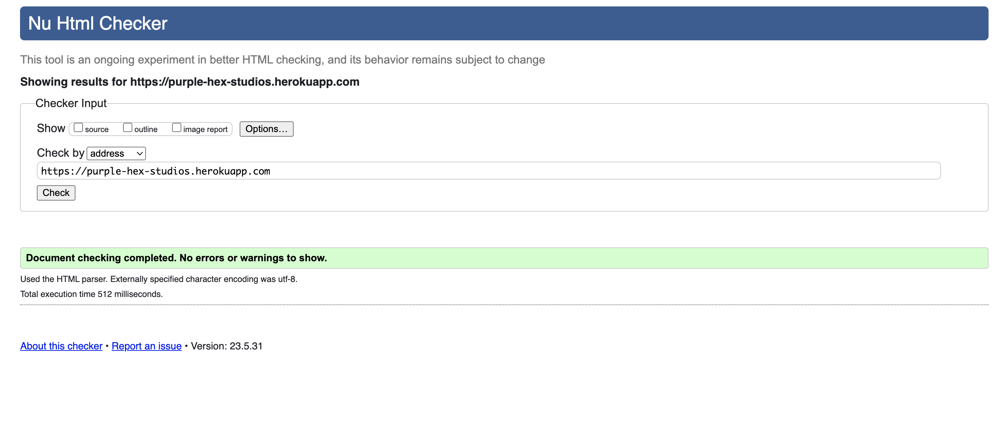
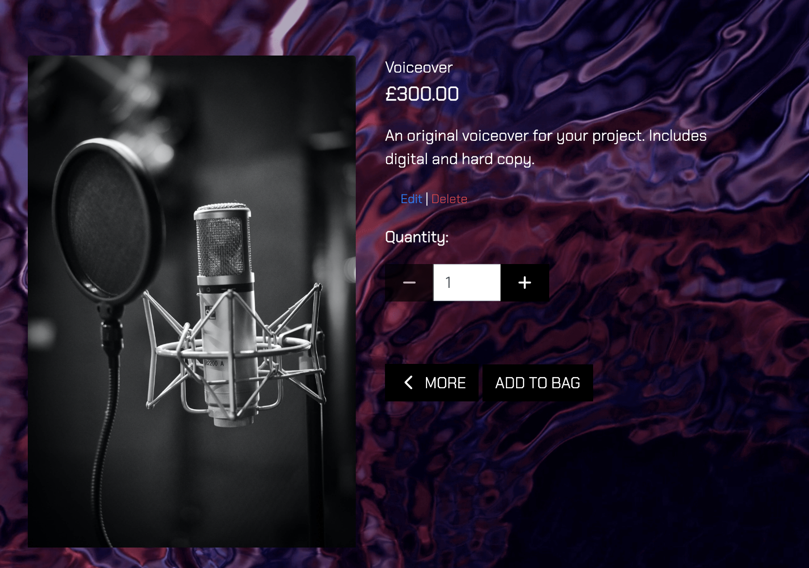

# Testing

Return back to the [README.md](README.md) file.


## Code Validation


### HTML

I have used the recommended [HTML W3C Validator](https://validator.w3.org) to validate all of my HTML files.

| Page | W3C URL | Screenshot | Notes |
| --- | --- | --- | --- |
| Home | [W3C](https://validator.w3.org/nu/?doc=https%3A%2F%2Fpurple-hex-studios.herokuapp.com) |  | Pass: No Errors |
| Contact | [W3C](https://validator.w3.org/nu/?doc=https%3A%2F%2Fpurple-hex-studios.herokuapp.com%2Fcontact%2F) |  | Pass: No Errors |
| Services | [W3C](https://validator.w3.org/nu/?doc=https%3A%2F%2Fpurple-hex-studios.herokuapp.com%2Fservices%2F) |  | Pass: No Errors |
| Service detail  | [W3C](https://validator.w3.org/nu/?doc=https%3A%2F%2Fpurple-hex-studios.herokuapp.com%2Fservices%2Fdetail%2F7%2F) |  | Pass: No Errors |
| Edit Service  | n/a |  | Pass: No Errors |
| Add Service | n/a |  | Pass: No Errors |
| Examples | [W3C](https://validator.w3.org/nu/?doc=https%3A%2F%2Fpurple-hex-studios.herokuapp.com%2Fexamples%2F)|  | Pass: No Errors |
| Checkout | [W3C](https://validator.w3.org/nu/?doc=https%3A%2F%2Fpurple-hex-studios.herokuapp.com%2Fcheckout%2F)|  | Pass: No Errors |
| Bag | [W3C](https://validator.w3.org/nu/?doc=https%3A%2F%2Fpurple-hex-studios.herokuapp.com%2Fbag%2F) |  | Pass: No Errors |
| Profile | n/a |  | Pass: No Errors |
| Login | [W3C](https://validator.w3.org/nu/?doc=https%3A%2F%2Fpurple-hex-studios.herokuapp.com%2Faccounts%2Flogin%2F) |  | Pass: No Errors |
| Sign Up | [W3C](https://validator.w3.org/nu/?doc=https%3A%2F%2Fpurple-hex-studios.herokuapp.com%2Faccounts%2Fsignup%2F) |  | Pass: No Errors |


### CSS

I have used the recommended [CSS Jigsaw Validator](https://jigsaw.w3.org/css-validator) to validate all of my CSS files.

⚠️⚠️⚠️⚠️⚠️ START OF NOTES (to be deleted) ⚠️⚠️⚠️⚠️⚠️

- If you are copying/pasting your HTML code, use this link: https://jigsaw.w3.org/css-validator/#validate_by_input
- (*recommended*) If you are using the live deployed site, use this link: https://jigsaw.w3.org/css-validator/#validate_by_uri

It's recommended to validate the live site if you only have a single CSS file using the deployed URL.
This will give you a custom URL as well, which you can use on your testing documentation.
It makes it easier to return back to the page to validate it again in the future.
The URL will look something like this:

- https://jigsaw.w3.org/css-validator/validator?uri=https%3A%2F%2FThomG1.github.io%2Fpurple-hex-studios

If you have multiple CSS files, then individual [validation by input](https://jigsaw.w3.org/css-validator/#validate_by_input)
is recommended for the additional CSS files.

**IMPORTANT**: Third-Party tools

If you're using extras like Bootstrap, Materialize, Font Awesome, then sometimes the validator
will attempt to also validate this code, even if it's not part of your own actual code.
You are not required to validate the external libraries or frameworks!

Sample CSS code validation documentation (tables are extremely helpful!):

🛑🛑🛑🛑🛑 END OF NOTES (to be deleted) 🛑🛑🛑🛑🛑

| File | Jigsaw URL | Screenshot | Notes |
| --- | --- | --- | --- |
| style.css | [Jigsaw](https://jigsaw.w3.org/css-validator/validator?uri=https%3A%2F%2FThomG1.github.io%2Fpurple-hex-studios) |  | Pass: No Errors |
| checkout.css | n/a |  | Pass: No Errors |
| x | x | x | repeat for all remaining CSS files |

### JavaScript

I have used the recommended [JShint Validator](https://jshint.com) to validate all of my JS files.

| File | Screenshot | Notes |
| --- | --- | --- |
| countryfield.js |  | No errors |
| stripe_elements.js |  | Undefined Stripe variable |


### Python


I have used the recommended [PEP8 CI Python Linter](https://pep8ci.herokuapp.com) to validate all of my Python files.

| File | CI URL | Screenshot | Notes |
| --- | --- | --- | --- |
| settings.py | [PEP8 CI](https://pep8ci.herokuapp.com/https://raw.githubusercontent.com/ThomG1/purple-hex-studios/main/purple_hex/settings.py) |  | E501 line too long |
| Purple Hex urls.py | [PEP8 CI](https://pep8ci.herokuapp.com/https://raw.githubusercontent.com/ThomG1/purple-hex-studios/main/purple_hex/urls.py) |  | Pass: No Errors |
| Services admin.py | [PEP8 CI](https://pep8ci.herokuapp.com/https://raw.githubusercontent.com/ThomG1/purple-hex-studios/main/services/admin.py) |  | Pass: No Errors |
| Services apps.py | [PEP8 CI](https://pep8ci.herokuapp.com/https://raw.githubusercontent.com/ThomG1/purple-hex-studios/main/services/apps.py) |  | Pass: No Errors |
| Services forms.py | [PEP8 CI](https://pep8ci.herokuapp.com/https://raw.githubusercontent.com/ThomG1/purple-hex-studios/main/purple_hex/wsgi.py) |  | Pass: No Errors |
| Services models.py | [PEP8 CI](https://pep8ci.herokuapp.com/https://raw.githubusercontent.com/ThomG1/purple-hex-studios/main/services/models.py) |  | Pass: No Errors |
| Services urls.py | [PEP8 CI](https://pep8ci.herokuapp.com/https://raw.githubusercontent.com/ThomG1/purple-hex-studios/main/services/urls.py) |  | Pass: No Errors |
| Services views.py | [PEP8 CI](https://pep8ci.herokuapp.com/https://raw.githubusercontent.com/ThomG1/purple-hex-studios/main/services/views.py) |  | Pass: No Errors |
| Bag apps.py | [PEP8 CI](https://pep8ci.herokuapp.com/https://raw.githubusercontent.com/ThomG1/purple-hex-studios/main/bag/apps.py) |  | Pass: No Errors |
| Bag contexts.py | [PEP8 CI](https://pep8ci.herokuapp.com/https://raw.githubusercontent.com/ThomG1/purple-hex-studios/main/bag/contexts.py) |  | Pass: No Errors |
| Bag urls.py | [PEP8 CI](https://pep8ci.herokuapp.com/https://raw.githubusercontent.com/ThomG1/purple-hex-studios/main/bag/urls.py) |  | Pass: No Errors |
| Bag views.py | [PEP8 CI](https://pep8ci.herokuapp.com/https://raw.githubusercontent.com/ThomG1/purple-hex-studios/main/bag/views.py) |  | Pass: No Errors |
| Checkout admin.py | [PEP8 CI](https://pep8ci.herokuapp.com/https://raw.githubusercontent.com/ThomG1/purple-hex-studios/main/checkout/admin.py) |  | Pass: No Errors |
| Checkout apps.py | [PEP8 CI](https://pep8ci.herokuapp.com/https://raw.githubusercontent.com/ThomG1/purple-hex-studios/main/checkout/apps.py) |  | Pass: No Errors |
| Checkout forms.py | [PEP8 CI](https://pep8ci.herokuapp.com/https://raw.githubusercontent.com/ThomG1/purple-hex-studios/main/checkout/forms.py) |  | Pass: No Errors |
| Checkout models.py | [PEP8 CI](https://pep8ci.herokuapp.com/https://raw.githubusercontent.com/ThomG1/purple-hex-studios/main/checkout/models.py) |  | Pass: No Errors |
| Checkout signals.py | [PEP8 CI](https://pep8ci.herokuapp.com/https://raw.githubusercontent.com/ThomG1/purple-hex-studios/main/checkout/signals.py) |  | Pass: No Errors |
| Checkout urls.py | [PEP8 CI](https://pep8ci.herokuapp.com/https://raw.githubusercontent.com/ThomG1/purple-hex-studios/main/checkout/urls.py) |  | Pass: No Errors |
| Checkout views.py | [PEP8 CI](https://pep8ci.herokuapp.com/https://raw.githubusercontent.com/ThomG1/purple-hex-studios/main/checkout/views.py) |  | Pass: No Errors |
| Profiles apps.py | [PEP8 CI](https://pep8ci.herokuapp.com/https://raw.githubusercontent.com/ThomG1/purple-hex-studios/main/profiles/apps.py) |  | Pass: No Errors |
| Profiles forms.py | [PEP8 CI](https://pep8ci.herokuapp.com/https://raw.githubusercontent.com/ThomG1/purple-hex-studios/main/profiles/forms.py) |  | Pass: No Errors |
| Profiles models.py | [PEP8 CI](https://pep8ci.herokuapp.com/https://raw.githubusercontent.com/ThomG1/purple-hex-studios/main/profiles/models.py) |  | Pass: No Errors |
| Profiles urls.py | [PEP8 CI](https://pep8ci.herokuapp.com/https://raw.githubusercontent.com/ThomG1/purple-hex-studios/main/profiles/urls.py) |  | Pass: No Errors |
| Profiles views.py | [PEP8 CI](https://pep8ci.herokuapp.com/https://raw.githubusercontent.com/ThomG1/purple-hex-studios/main/profiles/views.py) |  | Pass: No Errors |
| Home apps.py | [PEP8 CI](https://pep8ci.herokuapp.com/https://raw.githubusercontent.com/ThomG1/purple-hex-studios/main/home/apps.py) |  | Pass: No Errors |
| Home urls.py | [PEP8 CI](https://pep8ci.herokuapp.com/https://raw.githubusercontent.com/ThomG1/purple-hex-studios/main/home/urls.py) |  | Pass: No Errors |
| Home views.py | [PEP8 CI](https://pep8ci.herokuapp.com/https://raw.githubusercontent.com/ThomG1/purple-hex-studios/main/home/views.py) |  | Pass: No Errors |
| Contact admin.py | [PEP8 CI](https://pep8ci.herokuapp.com/https://raw.githubusercontent.com/ThomG1/purple-hex-studios/main/contact/admin.py) |  | Pass: No Errors |
| Contact apps.py | [PEP8 CI](https://pep8ci.herokuapp.com/https://raw.githubusercontent.com/ThomG1/purple-hex-studios/main/contact/apps.py) |  | Pass: No Errors |
| Contact forms.py | [PEP8 CI](https://pep8ci.herokuapp.com/https://raw.githubusercontent.com/ThomG1/purple-hex-studios/main/contact/forms.py) |  | Pass: No Errors |
| Contact models.py | [PEP8 CI](https://pep8ci.herokuapp.com/https://raw.githubusercontent.com/ThomG1/purple-hex-studios/main/contact/models.py) |  | Pass: No Errors |
| Contact urls.py | [PEP8 CI](https://pep8ci.herokuapp.com/https://raw.githubusercontent.com/ThomG1/purple-hex-studios/main/contact/urls.py) |  | Pass: No Errors |
| Contact views.py | [PEP8 CI](https://pep8ci.herokuapp.com/https://raw.githubusercontent.com/ThomG1/purple-hex-studios/main/contact/views.py) |  | Pass: No Errors |
| Examples admin.py | [PEP8 CI](https://pep8ci.herokuapp.com/https://raw.githubusercontent.com/ThomG1/purple-hex-studios/main/examples/admin.py) |  | Pass: No Errors |
| Examples apps.py | [PEP8 CI](https://pep8ci.herokuapp.com/https://raw.githubusercontent.com/ThomG1/purple-hex-studios/main/examples/apps.py) |  | Pass: No Errors |
| Examples models.py | [PEP8 CI](https://pep8ci.herokuapp.com/https://raw.githubusercontent.com/ThomG1/purple-hex-studios/main/examples/models.py) |  | Pass: No Errors |
| Examples urls.py | [PEP8 CI](https://pep8ci.herokuapp.com/https://raw.githubusercontent.com/ThomG1/purple-hex-studios/main/examples/urls.py) |  | Pass: No Errors |
| Examples views.py | [PEP8 CI](https://pep8ci.herokuapp.com/https://raw.githubusercontent.com/ThomG1/purple-hex-studios/main/examples/views.py) |  | Pass: No Errors |


| x | x | x | repeat for all remaining Python files |

**IMPORTANT**: Django settings.py

The Django settings.py file comes with 4 lines that are quite long, and will throw the `E501 line too long` error.
This is default behavior, but can be fixed by adding `# noqa` to the end of those lines.

Example:

```python
AUTH_PASSWORD_VALIDATORS = [
    {
        "NAME": "django.contrib.auth.password_validation.UserAttributeSimilarityValidator",  # noqa
    },
    {
        "NAME": "django.contrib.auth.password_validation.MinimumLengthValidator",  # noqa
    },
    {
        "NAME": "django.contrib.auth.password_validation.CommonPasswordValidator",  # noqa
    },
    {
        "NAME": "django.contrib.auth.password_validation.NumericPasswordValidator",  # noqa
    },
]
```


## Browser Compatibility

I've tested my deployed project on multiple browsers to check for compatibility issues.

| Browser | Screenshot | Notes |
| --- | --- | --- |
| Chrome |  | Works as expected |
| Firefox |  | Works as expected |
| Safari |  | Works as expected |


## Responsiveness

I've tested my deployed project on multiple devices to check for responsiveness issues.

| Device | Screenshot | Notes |
| --- | --- | --- |
| Mobile (DevTools) |  | Works as expected |
| Tablet (DevTools) |  | Works as expected |
| Desktop |  | Works as expected |


## Lighthouse Audit

I've tested my deployed project using the Lighthouse Audit tool to check for any major issues.

| Page | Size | Screenshot | Notes |
| --- | --- | --- | --- |
| Home | Desktop |  | Few warnings |
| Contact | Desktop |  | Some minor warnings |
| Services | Desktop |  | Few warnings |
| Bag | Desktop |  | Minor Warnings |
| Checkout | Desktop |  | Slow response time due to large images |
| x | x | x | repeat for any other tested pages/sizes |

## Defensive Programming

Defensive programming was manually tested with the below user acceptance testing:

| Page | User Action | Expected Result | Pass/Fail | Comments |
| --- | --- | --- | --- | --- |
| Home Page | | | | |
| | Click on Logo | Redirection to Home page | Pass | |
| | Click on account dropdown in navbar | Displays dropdown | Pass | |
| | Click on account register in navbar | Directs to register page | Pass | |
| | Click on account login in navbar | Directs to login page | Pass | |
| | Click on account management in navbar (if superuser) | Directs to add service page | Pass | |
| | Click on Services dropdown in navbar | Displays services dropdown filtering  | Pass | |
| | Click on all services in navbar | Directs to all services page | Pass | |
| | Click on film & tv in navbar | Filters film and tv services | Pass | |
| | Click on tutorials in navbar | Filters tutorials services | Pass | |
| | Click on mixing & mastering in navbar | Filters mixing & mastering services | Pass | |
| | Click examples on navbar | Directs to examples page | Pass | |
| | Click on Contact link in navbar | Redirection to Contact page | Pass | |
| | Click on bag in navbar | Directs to bag | Pass | |
| | Click on start creating button | Redirects to all services | Pass | |
| Services Page | | | | |
| | Load services | All services load as expected | Pass | |
| | Click on service | Redirect to service detail page | Pass | |
| | Click on edit (if superuser) | Redirect to edit service page | Pass | |
| | Click on delete (if superuser) | Deletes service| Pass | |
| Services Details Page | | | | |
| | Load service details | All details load as expected | Pass | |
| | Select quantity | Allows user to select quantity | Pass | |
| | Click on edit (if superuser) | Redirect to edit service page | Pass | |
| | Click on delete (if superuser) | Deletes service| Pass | |
| | Click add to bag | Adds service to bag | Pass | |
| | Click more | Redirects to all services | Pass | |
| Edit Services Page | | | | |
| | Edit Category | Allow user to edit category | Pass | |
| | Edit Name | Allow user to edit name | Pass | |
| | Edit Description | Allow user to edit description | Pass | |
| | Edit Price | Allow user to edit price | Pass | |
| | Edit image url | Allow user to edit image url | Pass | |
| | Edit image upload | Allow user to upload new image| Pass | |
| | Click update service | Updates service / redirects to service detail page | Pass | |
| | Click cancel | Redirects to all services page | Pass | |
| Examples Page | | | | |
| | Load images | All images load as expected | Pass | |
| | Use carousel next and previous buttons | works as expected | Pass | |
| Contact Page | | | | |
| | Enter first/last name | Field will accept freeform text | Pass | |
| | Enter valid email address | Field will only accept email address format | Pass | |
| | Enter message in textarea | Field will accept freeform text | Pass | |
| | Click the Submit button | Redirects user to form-dump | Pass | User must click 'Back' button to return |
| Sign Up | | | | |
| | Click on Sign Up button | Redirection to Sign Up page | Pass | |
| | Enter valid email address | Field will only accept email address format | Pass | |
| | Enter valid password (twice) | Field will only accept password format | Pass | |
| | Click on Sign Up button | Asks user to confirm email page | Pass | Email sent to user |
| | Confirm email | Redirects user to blank Sign In page | Pass | |
| Log In | | | | |
| | Click on the Login link | Redirection to Login page | Pass | |
| | Enter valid email address | Field will only accept email address format | Pass | |
| | Enter valid password | Field will only accept password format | Pass | |
| | Click Login button | Redirects user to home page | Pass | |
| Log Out | | | | |
| | Click Logout button | Redirects user to logout page | Pass | Confirms logout first |
| | Click Confirm Logout button | Redirects user to home page | Pass | |
| Profile | | | | |
| | Click on Profile button | User will be redirected to the Profile page | Pass | |
| | Click on the Edit button | User will be redirected to the edit profile page | Pass | |
| | Brute forcing the URL to get to another user's profile | User should be given an error | Pass | Redirects user back to own profile |


## User Story Testing


| User Story | Screenshot |
| --- | --- |
| As a new site user, I would like to easily navigate the site, so that I can explore what is available. |  |
| As a new site user, I would like to browse what services are on offer, so that I can consider a purchase. |  |
| As a new site user, I would like to easily make a purchase, so that I can progress towards what I want. |  |
| As a new site user, I would like to enjoy the original aesthetic of the application, so that I can return and shop again. |  |
| As a returning site user, I would like to save my details, so that I can make quicker purchases in future. |  |
| As a returning site user, I would like to contact the site, so that I can answer any queries. |  |
| As a returning site user, I would like to explore another cateogory of service, so that I can expand what I'm creating. |  |
| As a returning site user, I would like to explore the sites previous work, so that I can inform my future decisions.|  |
| As a site administrator, I should be able to add new services to my site, so that I can interest new customers. |  |
| As a site administrator, I should be able to ammend existing services, so that I can meet the needs of the studio. |  |
| As a site administrator, I should be able to delete exisiting services, so that I can meet the needs of the studio. |  |
| As a site administrator, I should be able to keep track of my orders, so that I can analyse the data. |  |


### GitHub **Issues**

There are no remaining bugs that I am aware of.
